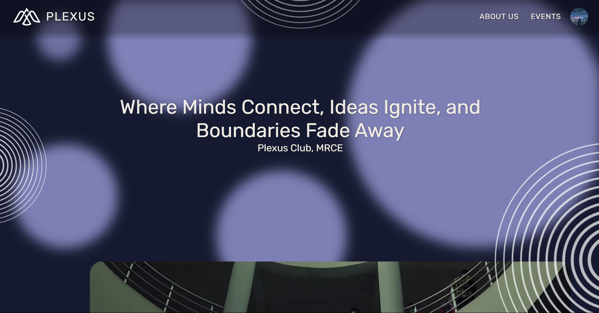
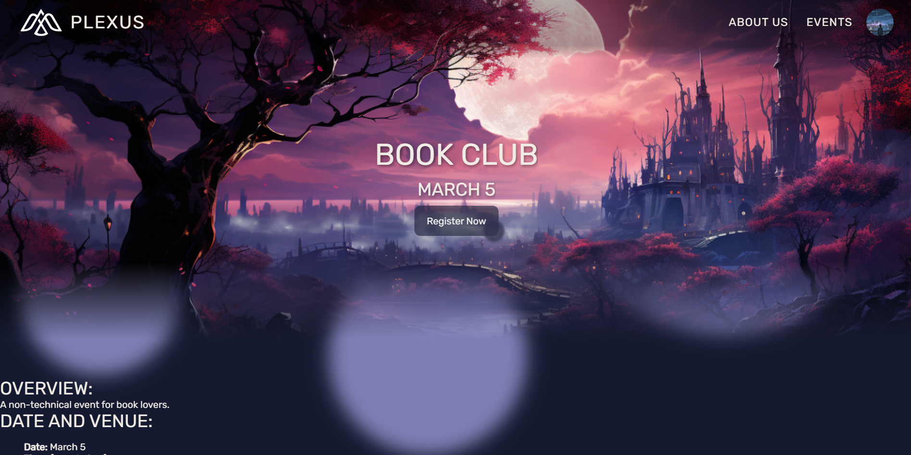

# Plexus College AIML Club Website

Welcome to the GitHub repository for the Plexus AIML Club website! This repository contains the source code for the website, along with a Node.js backend branch.
---
## Website Preview
- Home Page: [https://harshrb2424.github.io/plexus-demo/](https://harshrb2424.github.io/plexus-demo/)
- Loading Page: [https://harshrb2424.github.io/plexus-demo/loading.html](https://harshrb2424.github.io/plexus-demo/loading.html)
- Event Page: [https://harshrb2424.github.io/plexus-demo/event.html](https://harshrb2424.github.io/plexus-demo/event.html)
---
## Node.js Backend
If you want to run the website with the Node.js backend, follow these steps:

1. Clone the repository:
   ```bash
   git clone https://github.com/Harshrb2424/plexus-demo.git
   ```

2. Navigate to the Node.js branch:
   ```bash
   cd plexus-demo
   git checkout NodeJS
   ```

3. Install dependencies:
   ```bash
   npm install
   ```

4. Set up the database:
   - Use PostgreSQL or any other SQL database.
   - Execute the SQL commands in `database.sql` to initialize the database.
   - Update the database access information in `server.js` (line 8):
     ```javascript
     const client = new pg.Client({
       user: "yourUser",
       host: "yourHost",
       database: "yourDatabase",
       password: "yourPassword",
       port: 2424,
     });
     ```

5. Create a `.env` file with the following content:
   ```env
   GOOGLE_CLIENT_ID=YOUR_GOOGLE_CLIENT_ID
   GOOGLE_CLIENT_SECRET=YOUR_GOOGLE_CLIENT_SECRET
   ```

6. Run the Node.js server:
   ```bash
   node ./server.js
   ```
---
## Preview

   

   
---